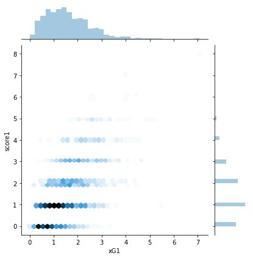
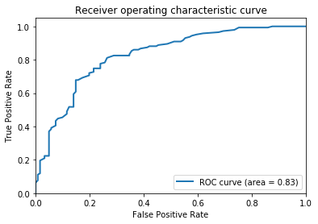

```python
import pandas as pd
import numpy as np
import warnings
warnings.filterwarnings('ignore')
```

# Making the dataset
We will use all of the datasets in the slides, implmenting the process that we described to calculate win/lose/draws ratios, form and home result.


```python
#loading historical matches
league = pd.read_csv("england.csv")
league = league[league.Season >= 1990].reset_index(drop = True)
league = league[["Date", "Season", "home", "visitor", "hgoal", "vgoal"]]


facup = pd.read_csv("facup.csv")
facup = facup[facup.Season >= 1990].reset_index(drop = True)
facup = facup[["Date", "Season", "home", "visitor", "hgoal", "vgoal"]]


leaguecup = pd.read_csv("leaguecup.csv")
leaguecup = leaguecup[leaguecup.Season >= 1990].reset_index(drop = True)
leaguecup = leaguecup[["Date", "Season", "home", "visitor", "hgoal", "vgoal"]]


playoffs = pd.read_csv("englandplayoffs.csv")
playoffs = playoffs[playoffs.Season >= 1990].reset_index(drop = True)
playoffs = playoffs[["Date", "Season", "home", "visitor", "hgoal", "vgoal"]]


league18 = pd.read_csv("league 2018.csv")
only_date = lambda x: x[0:10]
league18["Date"] = league18.Date.apply(only_date)
league18["Date"] =pd.to_datetime(league18.Date, format='%d/%m/%Y')
home_score = lambda x: x[0]
visitor_score = lambda x: x[4]
league18["hgoal"] = league18.Result.apply(home_score)
league18["vgoal"] = league18.Result.apply(visitor_score)
league18.drop(columns=['Result'],inplace = True)


#putting all historical matches in one dataframe
match_records = pd.concat([league,facup,leaguecup,playoffs,league18]).reset_index(drop = True)
match_records["Date"] =pd.to_datetime(match_records.Date)
match_records = match_records.sort_values(by="Date").reset_index(drop = True)
match_records.dropna(how="all", inplace=True)
match_records['home_result'] = match_records.apply(lambda row: "win" if row['hgoal'] > row['vgoal'] else ("draw" if row['hgoal'] == row['vgoal'] else "loss"), axis = 1)
match_records = match_records[["Date", "Season", "home", "visitor", "home_result"]]


#calculating historic win/draw/lose percentages
def historic_percentages(row):
    number_of_matches = 10
    matches = match_records[(match_records.home == row.home) & (match_records.visitor == row.visitor) & (match_records.Season < row.Season)].tail(number_of_matches)
    number_of_matches = matches["home"].count()
    if number_of_matches == 0:
        return 1/3,1/3,1/3
    count_series = matches.home_result.value_counts()
    indices = count_series.index.tolist()
    counts = count_series.to_frame().transpose()
    if "win" in indices:
        win = int(counts["win"])/number_of_matches
    else:
        win = 0
    if "draw" in indices:
        draw = int(counts["draw"])/number_of_matches
    else:
        draw = 0
    if "loss" in indices:
        loss = int(counts["loss"])/number_of_matches
    else:
        loss = 0
    return win, draw, loss

fixtures = pd.read_csv("Fixtures_16_to_19.csv")
fixtures["win%"], fixtures["draw%"], fixtures["loss%"] =  zip(*fixtures.apply(historic_percentages, axis = 1))

#adding historical percentages to main data
df = pd.read_csv("Spi.csv")
df = pd.merge(df,fixtures, how="left")
df["Date"] =pd.to_datetime(df.Date)
match_records = match_records.drop_duplicates()
df = pd.merge(df,match_records, how="left")


#projecting the rest of 2019 league positions based on history only
def league_points_calculator(row):
    if row['home'] == i:
        return 3*row["prob1"] + 1*row["probtie"]
    else:
        return 3*row["prob2"] + 1*row["probtie"]

df_2019 = df[df.Season == 2019]
teams_2019 = df_2019.home.unique()

tables = []
for i in teams_2019:

    cursor = df[((df.Season == 2019) & (df.Round > 16)) & ((df.home == i)|(df.visitor == i))][["Date", "Season", "Round", "home", "visitor", "prob1", "prob2", "probtie"]]
    cursor['points'] = cursor.apply(league_points_calculator, axis = 1)
    tables.append((cursor[["Round","points"]].rename(columns={"points": i}).set_index('Round').T))

cursor = pd.concat(tables).reset_index()
z =pd.read_csv("2019_round16_points.csv").set_index('index').reset_index()
rest_of_2019 = pd.merge(z,cursor).rename(columns={"16": 16})

#making a per round league table (points) of the rest of 2019 based on history only
def points_adder(table):
    for i in range(17,39):
        table[i] = table[i] + table[i-1]
    return table

rest_of_2019 = points_adder(rest_of_2019)

#making a table of per round league table (positions) of the rest of 2019 based on history only
for i in range(16,39):
    rest_of_2019 = rest_of_2019.sort_values(by=[i],ascending=False)
    rest_of_2019[i] = list(range(1,21))


#adding home team legue position and visitor team league position to every match in the main dataframe
pos_2016 = pd.read_csv("2016_league_positions.csv")
pos_2017 = pd.read_csv("2017_league_positions.csv")
pos_2018 = pd.read_csv("2018_league_positions.csv")

pos_2019_until_16 = pd.read_csv("2019_league_positions_round 16.csv")
def positionator(row, season, df_, from_, to_, home):
    if home:
        x = row.home
    else:
        x = row.visitor
    if row.Season == season and row.Round in list(range(from_,to_)):
        if season == 2019 and from_>16:
            return float(df_[(row.Round)][df_["index"] == x])
        else:
            return float(df_[str(row.Round)][df_["index"] == x])
    else:
        if home:
            return float(row.home_pos)
        else:
            return float(row.visitor_pos)

iterator = [((2016, pos_2016, 1, 39, True), (2016, pos_2016, 1, 39, False)), ((2017, pos_2017, 1, 39, True), (2017, pos_2017, 1, 39, False)), ((2018, pos_2018, 1, 39, True), (2018, pos_2018, 1, 39, False)), ((2019, pos_2019_until_16, 1, 17, True), (2019, pos_2019_until_16, 1, 17, False)), ((2019, rest_of_2019, 17, 39, True), (2019, rest_of_2019, 17, 39, False))]

df['home_pos'] ,df['visitor_pos'] = 21, 21

for i in iterator:
    df['home_pos'] = df.apply(positionator, args=i[0], axis = 1)
    df['visitor_pos'] = df.apply(positionator, args=i[1], axis = 1)


#adding average 2019 xG and xGA to every team in the rest of 2019
df['xG1'] = df["xg1"] + df["nsxg1"]
df['xG2'] = df["xg2"] + df["nsxg2"]
average_2019_xg = pd.read_csv("Average_2019_xG.csv")
def home_xG(row):
    if row.Season == 2019 and row.Round > 16:
        return float(average_2019_xg["xG"][average_2019_xg["index"] == row.home])
    else:
        return float(row.xg1)


def visitor_xG(row):
    if row.Season == 2019 and row.Round > 16:
        return float(average_2019_xg["xG"][average_2019_xg["index"] == row.visitor])
    else:
        return float(row.xg2)


df['xG1'] = df.apply(home_xG, axis = 1)
df['xG2'] = df.apply(visitor_xG, axis = 1)

cursor = df.iloc[0:1320].copy()

def home_result_df(row):
    if row.score1 != np.nan:
        if row.score1 > row.score2:
            return "win"
        elif row.score1 == row.score2:
            return "draw"
        else:
            return "loss"
    else:
        return np.nan

cursor["home_result"] = cursor.apply(home_result_df, axis=1)
df.iloc[:1320,-5] = cursor["home_result"]

def results_corrector(row, team):
    team[0]
    if row.visitor == team:
        if row.home_result == "win":
            return "loss"
        elif row.home_result == "loss":
            return "win"
        else:
            return "draw"
    else:
        return row.home_result

def form_calculator(row, df, home):
    if home:
        x = row.home
    else:
        x = row.visitor
    number_of_matches = 5
    matches = df[((df.home == x) | (df.visitor == x)) & ((df.Season == row.Season) &(df.Round < row.Round))].tail(number_of_matches)[["home", "visitor", "home_result"]]
    number_of_matches = matches["home"].count()
    if number_of_matches == 0:
        return (7/5)
    matches["corrected_results"] = matches.apply(results_corrector, args=([x]), axis = 1)
    count_series = matches.corrected_results.value_counts()
    indices = count_series.index.tolist()
    counts = count_series.to_frame().transpose()
    counts_columns = counts.columns.tolist()
    if "win" in counts_columns:
        win_points = counts["win"]*3
    else:
        win_points = 0
    if "draw" in counts_columns:
        draw_points = counts["draw"]*1
    else:
        draw_points = 0
    return float(win_points + draw_points)/float(number_of_matches)
    
df["home_form"] = df.apply(form_calculator, args = (df, True), axis=1)
df["visitor_form"] = df.apply(form_calculator,args = (df, False),axis=1)

#arranging the main dataframe
df = df[['Date', 'Season', 'Round', 'home', 'visitor', 'home_pos', 'visitor_pos', 'spi1', 'spi2', 'win%', 'draw%', 'loss%', 'home_form', 'visitor_form', 'importance1', 'importance2', 'xG1', 'xG2', 'proj_score1', 'proj_score2', 'home_result', 'score1', 'score2']]

df_played_matches = df.iloc[0:1320]

```

# Exploratory Analysis

### Result Distribution


```python
import seaborn as sns
%matplotlib inline
import collections, numpy
sns.countplot(df.home_result)

class clr:
    P = '\033[95m'
    C = '\033[96m'
    DC = '\033[36m'
    B = '\033[94m'
    G = '\033[92m'
    Y = '\033[93m'
    R = '\033[91m'
    BOLD = '\033[1m'
    UL = '\033[4m'
    END = '\033[0m'

print(clr.BOLD + clr.UL + clr.B + 'Home Result of already played matches' + clr.END)
print(clr.BOLD + clr.G + '  the graph showing that home team is more likely to win the match' + clr.END)
```

    Home Result of already played matches
      the graph showing that home team is more likely to win the match


### Distribution of Importance1


```python
sns.distplot(df.importance1.dropna())

print(clr.BOLD + clr.UL + clr.B + 'Importance of match from home team prespective' + clr.END)
print(clr.BOLD + clr.G + '  the graph showing importance of match from home team prespective distribution' + clr.END)
```

    Importance of match from home team prespective
      the graph showing importance of match from home team prespective distribution


### Distribution of SPI1


```python
sns.distplot(df.spi1)
print(clr.BOLD + clr.UL + clr.B + 'Soccer Power Index (SPI) of home team' + clr.END)
print(clr.BOLD + clr.G + '  the graph showing Soccer Power Index (SPI) of home team Distribution' + clr.END)
```

    Soccer Power Index (SPI) of home team
      the graph showing Soccer Power Index (SPI) of home team Distribution


### XG Distribution


```python
sns.distplot(df.xG1)
print(clr.BOLD + clr.UL + clr.B + 'Expected Goals (xG) for home team' + clr.END)
print(clr.BOLD + clr.G + '  the graph showing xG for home team distribution' + clr.END)
```

    Expected Goals (xG) for home team
      the graph showing xG for home team distribution


```python
sns.boxplot("home_result", "spi1", data=df)

print(clr.BOLD + clr.UL + clr.B + 'SPI of home team Box Plot' + clr.END)
print(clr.BOLD + clr.G + '  the graph showing that win probability is directly proportional with SPI' + clr.END)
```

    SPI of home team Box Plot
      the graph showing that win probability is directly proportional with SPI


```python
sns.boxplot("home_result", "home_pos", data=df)
print(clr.BOLD + clr.UL + clr.B + 'Box Plot of home result vs position' + clr.END)
print(clr.BOLD + clr.G + '  the graph showing that home team is more likely to win when it has a higher rank' + clr.END)
```

    Box Plot of home result vs position
      the graph showing that home team is more likely to win when it has a higher rank


## Diffrent features relation to th final labels of Win/Lose/Draw


```python
sns.boxplot("home_result", "importance1", data=df)
print(clr.BOLD + clr.UL + clr.B + 'Box Plot of home result vs Importance' + clr.END)
print(clr.BOLD + clr.G + '  the graph showing that home team is more likely to win when the match is more important' + clr.END)
```

    Box Plot of home result vs Importance
      the graph showing that home team is more likely to win when the match is more important


```python
sns.boxplot("home_result", "xG1", data=df)
print(clr.BOLD + clr.UL + clr.B + 'Box Plot of home result vs xG' + clr.END)
print(clr.BOLD + clr.G + '  the graph showing that home team is more likely to win when the xG is higher' + clr.END)
```

    Box Plot of home result vs xG
      the graph showing that home team is more likely to win when the xG is higher


```python
sns.boxplot("home_result", "win%", data=df)
print(clr.BOLD + clr.UL + clr.B + 'Box Plot of home result vs win%' + clr.END)
print(clr.BOLD + clr.G + '  the graph showing that home team is more likely to win when the win% gets higher' + clr.END)
```

    Box Plot of home result vs win%
      the graph showing that home team is more likely to win when the win% gets higher


```python
sns.boxplot("home_result", "draw%", data=df)
print(clr.BOLD + clr.UL + clr.B + 'Box Plot of home result vs draw%' + clr.END)
print(clr.BOLD + clr.G + '  the graph showing that it is hard to predict draw' + clr.END)
```

    Box Plot of home result vs draw%
      the graph showing that it is hard to predict draw


```python
sns.boxplot("home_result", "loss%", data=df)
print(clr.BOLD + clr.UL + clr.B + 'Box Plot of home result vs loss%' + clr.END)
print(clr.BOLD + clr.G + '  the graph showing that home team is more likely to lose when the loss% gets higher' + clr.END)
```

    Box Plot of home result vs loss%
      the graph showing that home team is more likely to lose when the loss% gets higher


```python
sns.boxplot("home_result", "home_form", data=df)
print(clr.BOLD + clr.UL + clr.B + 'Box Plot of home result vs form (average points in last 5 matches)' + clr.END)
print(clr.BOLD + clr.G + '  the graph showing that home team is more likely to win when form gets higher' + clr.END)
```

    Box Plot of home result vs form (average points in last 5 matches)
      the graph showing that home team is more likely to win when form gets higher


```python
sns.boxplot("home_result", "visitor_form", data=df)
print(clr.BOLD + clr.UL + clr.B + 'Box Plot of home result vs visitor form' + clr.END)
print(clr.BOLD + clr.G + '  the graph showing that home team is more likely to lose when visitor form gets higher' + clr.END)
```

    Box Plot of home result vs visitor form
      the graph showing that home team is more likely to lose when visitor form gets higher


## Relation between importance and league position and SPI


```python
sns.lineplot("home_pos","importance1", data=df)
print(clr.BOLD + clr.UL + clr.B + 'The Relation Between home Posistion and Importance' + clr.END)
print(clr.BOLD + clr.G + '  the graph showing that importance of the match increasing when position is high or low \n  and decreasing when position in between' + clr.END)
```

    The Relation Between home Posistion and Importance
      the graph showing that importance of the match increasing when position is high or low 
      and decreasing when position in between


```python
sns.lineplot("visitor_pos", "importance2", data = df)
print(clr.BOLD + clr.UL + clr.B + 'The Relation Between visitor Posistion and Importance' + clr.END)
print(clr.BOLD + clr.G + '  the graph is confirming the previous findings' + clr.END)
```

    The Relation Between visitor Posistion and Importance
      the graph is confirming the previous findings


```python
sns.jointplot("spi1", "importance1", data = df, kind="hex")
print(clr.BOLD + clr.UL + clr.B + 'Joint plot of Importance and SPI from home team prespective' + clr.END)
print(clr.BOLD + clr.G + '  the graph showing that matches of teams with low and high SPI get higher importance than\n  teams with medium SPI' + clr.END)
```

    Joint plot of Importance and SPI from home team prespective
      the graph showing that matches of teams with low and high SPI get higher importance than
      teams with medium SPI


## Relationship between XG, Projected Scores and Real Scores


```python
sns.jointplot("xG1", "score1", data = df, kind="hex")
print(clr.BOLD + clr.UL + clr.B + 'Joint Plot of xG and score of home team' + clr.END)
print(clr.BOLD + clr.G + '  the graph showing that home team actual score is close to the expected goals' + clr.END)
```

    Joint Plot of xG and score of home team
      the graph showing that home team actual score is close to the expected goals





```python
sns.jointplot("xG1", "proj_score1", data = df, kind = 'hex')
print(clr.BOLD + clr.UL + clr.B + 'Joint Plot of xG and projected score of home team' + clr.END)
print(clr.BOLD + clr.G + '  the graph showing that home team xG is close to 538 projected score' + clr.END)
```

    Joint Plot of xG and projected score of home team
      the graph showing that home team xG is close to 538 projected score


```python
sns.jointplot("proj_score1", "score1", data = df, kind = 'hex')
print(clr.BOLD + clr.UL + clr.B + 'Joint Plot of projected score and actual score of home team' + clr.END)
print(clr.BOLD + clr.G + '  the graph showing that home team actual score is close to the 538 projected score' + clr.END)
```

    Joint Plot of projected score and actual score of home team
      the graph showing that home team actual score is close to the 538 projected score


```python
sns.lineplot("xG1", "proj_score1", data = df_played_matches)
print(clr.BOLD + clr.UL + clr.B + 'Line plot of projected score and xG from home team prespective' + clr.END)
print(clr.BOLD + clr.G + '  the graph showing that home team xG is close to 538 projected score' + clr.END)
```

    Line plot of projected score and xG from home team prespective
      the graph showing that home team xG is close to 538 projected score


```python
sns.lineplot("xG1", "score1", data = df_played_matches)

print(clr.BOLD + clr.UL + clr.B + 'Line Plot of xG and score of home team' + clr.END)
print(clr.BOLD + clr.G + '  the graph showing that home team actual score is close to the expected goals' + clr.END)
```

    Line Plot of xG and score of home team
      the graph showing that home team actual score is close to the expected goals


## Pair Plots


```python
fig = sns.pairplot(data = df_played_matches[['home_pos', 'visitor_pos', 'spi1', 'spi2', 'win%', 'loss%',
       'importance1', 'importance2', 'home_form', 'visitor_form', 'xG1', 'xG2', 'home_result']], hue = "home_result")
fig.savefig("image.png")

print(clr.BOLD + clr.UL + clr.B + 'Pair Plot Graph' + clr.END)
print(clr.BOLD + clr.G + '  the graph showing that some features are seperable like position feature' + clr.END)
```

    Pair Plot Graph
      the graph showing that some features are seperable like position feature


# Predicting Importance


```python
from sklearn import metrics
from sklearn.kernel_ridge import KernelRidge
from sklearn.svm import SVR
# home teams
training_X = np.asarray(df_played_matches[df_played_matches.Season != 2019][['home_pos']]).reshape(-1, 1)
validation_X = np.asarray(df_played_matches[df_played_matches.Season == 2019][['home_pos']]).reshape(-1, 1)
wanted_X = np.asarray(df.iloc[1320:][['home_pos']]).reshape(-1, 1)

training_y = np.asarray(df_played_matches[df_played_matches.Season != 2019].importance1).reshape(-1, 1)
validation_y = np.asarray(df_played_matches[df_played_matches.Season == 2019].importance1).reshape(-1, 1)

# Kerner Ridge Regression
Importance_model = KernelRidge()
Importance_model.fit(training_X, training_y)

predicted_validation_y = Importance_model.predict(validation_X)
print("Kernel Ridge")
print(f"Mean Absolute Error: {metrics.mean_absolute_error(validation_y, predicted_validation_y)}")
mse = np.sqrt(metrics.mean_squared_error(validation_y, predicted_validation_y))
print(f"Root of the Mean Square Error {mse}")


# Support Vector Regression
Importance_model = SVR()
Importance_model.fit(training_X, training_y)

predicted_validation_y = Importance_model.predict(validation_X)
print("\n")
print("Support Vector Regressor")
print(f"Mean Absolute Error: {metrics.mean_absolute_error(validation_y, predicted_validation_y)}")
mse = np.sqrt(metrics.mean_squared_error(validation_y, predicted_validation_y))
print(f"Root of the Mean Square Error {mse}")

from sklearn.svm import NuSVR
Importance_model = NuSVR()
Importance_model.fit(training_X, training_y)
predicted_validation_y = Importance_model.predict(validation_X)
print("\n")
print("Nu Support Vector Regressor")
print(f"Mean Absolute Error: {metrics.mean_absolute_error(validation_y, predicted_validation_y)}")
mse = np.sqrt(metrics.mean_squared_error(validation_y, predicted_validation_y))
print(f"Root of the Mean Square Error {mse}")


# we chose NuSVR
training_X = np.vstack((training_X, validation_X))
training_y = np.vstack((training_y, validation_y))

Importance1_model = NuSVR()
Importance1_model.fit(training_X, training_y)

predicted_y = Importance1_model.predict(wanted_X)
df.iloc[1320:,-9] = predicted_y


#visitor teams
training_X = np.asarray(df_played_matches[df_played_matches.Season != 2019][['visitor_pos']]).reshape(-1, 1)
validation_X = np.asarray(df_played_matches[df_played_matches.Season == 2019][['visitor_pos']]).reshape(-1, 1)
wanted_X = np.asarray(df.iloc[1320:][['visitor_pos']]).reshape(-1, 1)

training_y = np.asarray(df_played_matches[df_played_matches.Season != 2019].importance2).reshape(-1, 1)
validation_y = np.asarray(df_played_matches[df_played_matches.Season == 2019].importance2).reshape(-1, 1)


#We chosose SVR for importance 2
training_X = np.vstack((training_X, validation_X))
training_y = np.vstack((training_y, validation_y))

Importance2_model = NuSVR()
Importance2_model.fit(training_X, training_y)

predicted_y = Importance2_model.predict(wanted_X)
df.iloc[1320:,-8] = predicted_y


sns.lineplot("home_pos","importance1", data=df.iloc[1320:])

sns.lineplot("home_pos","importance1", data=df)

print(clr.BOLD + clr.UL + clr.B + '\nLine Plot of home position and importance' + clr.END)
print(clr.BOLD + clr.G + '  the graph showing that our prediction pattern using NuSVR model (blue) is very close to real pattern' + clr.END)
```

    Kernel Ridge
    Mean Absolute Error: 21.544287420773617
    Root of the Mean Square Error 30.86950360507601
    
    
    Support Vector Regressor
    Mean Absolute Error: 12.768116164282523
    Root of the Mean Square Error 17.17464625977751
    
    
    Nu Support Vector Regressor
    Mean Absolute Error: 11.864194100087447
    Root of the Mean Square Error 15.857654635428204
    
    Line Plot of home position and importance
      the graph showing that our prediction pattern using NuSVR model (blue) is very close to real pattern


# Logistic Regression One versus all test run


```python
import statsmodels.discrete.discrete_model as ds
import scipy.stats as st
from statsmodels.tools import add_constant as add_constant
df_win_lose = df_played_matches[['home_pos', 'visitor_pos', 'spi1', 'spi2', 'loss%',
       'importance1', 'importance2', 'home_form', 'visitor_form', 'xG1', 'xG2', 'home_result']].copy()

from sklearn.preprocessing import LabelEncoder, RobustScaler
enc = LabelEncoder()

label_encoder = enc.fit(df_win_lose.home_result)
y = label_encoder.transform(df_win_lose.home_result)
df_win_lose["home_result"] = y
scaler = RobustScaler()
scaler.fit(df_win_lose)
X_train = scaler.transform(df_win_lose)


df_win_lose = df_win_lose.astype(float)
df_constant = add_constant(df_win_lose)

cols=df_win_lose.columns[:-1]
df_win_lose["home_result"] = y
model= ds.MNLogit(df_win_lose.home_result,df_constant[cols])
result=model.fit()


print(clr.BOLD + clr.UL + clr.B + '\nLogistic Regression Summary' + clr.END)
print(clr.BOLD + clr.G + '  Refering to 0:draw, 1:win, 2:loss, the logistic regression showing that it is difficult to \n  differentiate between draw and loss (P-Value > 0.05%) but P-Value is < 0.05% in case of\n  draw and win' + clr.END)

result.summary()

#draw win loss
```

    Optimization terminated successfully.
             Current function value: 0.758145
             Iterations 7
    
    Logistic Regression Summary
      Refering to 0:draw, 1:win, 2:loss, the logistic regression showing that it is difficult to 
      differentiate between draw and loss (P-Value > 0.05%) but P-Value is < 0.05% in case of
      draw and win


<table class="simpletable">
<caption>MNLogit Regression Results</caption>
<tr>
  <th>Dep. Variable:</th>      <td>home_result</td>   <th>  No. Observations:  </th>   <td>  1320</td>  
</tr>
<tr>
  <th>Model:</th>                <td>MNLogit</td>     <th>  Df Residuals:      </th>   <td>  1298</td>  
</tr>
<tr>
  <th>Method:</th>                 <td>MLE</td>       <th>  Df Model:          </th>   <td>    20</td>  
</tr>
<tr>
  <th>Date:</th>            <td>Tue, 21 Jan 2020</td> <th>  Pseudo R-squ.:     </th>   <td>0.2807</td>  
</tr>
<tr>
  <th>Time:</th>                <td>08:39:43</td>     <th>  Log-Likelihood:    </th>  <td> -1000.8</td> 
</tr>
<tr>
  <th>converged:</th>             <td>True</td>       <th>  LL-Null:           </th>  <td> -1391.3</td> 
</tr>
<tr>
  <th>Covariance Type:</th>     <td>nonrobust</td>    <th>  LLR p-value:       </th> <td>1.512e-152</td>
</tr>
</table>
<table class="simpletable">
<tr>
  <th>home_result=1</th>    <th>coef</th>     <th>std err</th>      <th>z</th>      <th>P>|z|</th>  <th>[0.025</th>    <th>0.975]</th>  
</tr>
<tr>
  <th>home_pos</th>      <td>    0.1527</td> <td>    0.024</td> <td>    6.367</td> <td> 0.000</td> <td>    0.106</td> <td>    0.200</td>
</tr>
<tr>
  <th>visitor_pos</th>   <td>   -0.1775</td> <td>    0.026</td> <td>   -6.940</td> <td> 0.000</td> <td>   -0.228</td> <td>   -0.127</td>
</tr>
<tr>
  <th>spi1</th>          <td>    0.0181</td> <td>    0.012</td> <td>    1.560</td> <td> 0.119</td> <td>   -0.005</td> <td>    0.041</td>
</tr>
<tr>
  <th>spi2</th>          <td>   -0.0192</td> <td>    0.012</td> <td>   -1.580</td> <td> 0.114</td> <td>   -0.043</td> <td>    0.005</td>
</tr>
<tr>
  <th>loss%</th>         <td>   -0.5098</td> <td>    0.455</td> <td>   -1.121</td> <td> 0.262</td> <td>   -1.401</td> <td>    0.381</td>
</tr>
<tr>
  <th>importance1</th>   <td>   -0.0133</td> <td>    0.004</td> <td>   -3.262</td> <td> 0.001</td> <td>   -0.021</td> <td>   -0.005</td>
</tr>
<tr>
  <th>importance2</th>   <td>    0.0069</td> <td>    0.004</td> <td>    1.850</td> <td> 0.064</td> <td>   -0.000</td> <td>    0.014</td>
</tr>
<tr>
  <th>home_form</th>     <td>    0.4733</td> <td>    0.169</td> <td>    2.801</td> <td> 0.005</td> <td>    0.142</td> <td>    0.805</td>
</tr>
<tr>
  <th>visitor_form</th>  <td>   -0.6178</td> <td>    0.173</td> <td>   -3.564</td> <td> 0.000</td> <td>   -0.957</td> <td>   -0.278</td>
</tr>
<tr>
  <th>xG1</th>           <td>   -0.4258</td> <td>    0.137</td> <td>   -3.097</td> <td> 0.002</td> <td>   -0.695</td> <td>   -0.156</td>
</tr>
<tr>
  <th>xG2</th>           <td>    0.9807</td> <td>    0.140</td> <td>    7.013</td> <td> 0.000</td> <td>    0.707</td> <td>    1.255</td>
</tr>
<tr>
  <th>home_result=2</th>    <th>coef</th>     <th>std err</th>      <th>z</th>      <th>P>|z|</th>  <th>[0.025</th>    <th>0.975]</th>  
</tr>
<tr>
  <th>home_pos</th>      <td>   -0.1427</td> <td>    0.022</td> <td>   -6.599</td> <td> 0.000</td> <td>   -0.185</td> <td>   -0.100</td>
</tr>
<tr>
  <th>visitor_pos</th>   <td>    0.0996</td> <td>    0.021</td> <td>    4.759</td> <td> 0.000</td> <td>    0.059</td> <td>    0.141</td>
</tr>
<tr>
  <th>spi1</th>          <td>   -0.0242</td> <td>    0.010</td> <td>   -2.380</td> <td> 0.017</td> <td>   -0.044</td> <td>   -0.004</td>
</tr>
<tr>
  <th>spi2</th>          <td>    0.0393</td> <td>    0.011</td> <td>    3.680</td> <td> 0.000</td> <td>    0.018</td> <td>    0.060</td>
</tr>
<tr>
  <th>loss%</th>         <td>   -0.6613</td> <td>    0.411</td> <td>   -1.608</td> <td> 0.108</td> <td>   -1.467</td> <td>    0.145</td>
</tr>
<tr>
  <th>importance1</th>   <td>    0.0062</td> <td>    0.003</td> <td>    1.887</td> <td> 0.059</td> <td>   -0.000</td> <td>    0.013</td>
</tr>
<tr>
  <th>importance2</th>   <td>   -0.0061</td> <td>    0.003</td> <td>   -1.827</td> <td> 0.068</td> <td>   -0.013</td> <td>    0.000</td>
</tr>
<tr>
  <th>home_form</th>     <td>   -0.4864</td> <td>    0.149</td> <td>   -3.270</td> <td> 0.001</td> <td>   -0.778</td> <td>   -0.195</td>
</tr>
<tr>
  <th>visitor_form</th>  <td>    0.0101</td> <td>    0.152</td> <td>    0.067</td> <td> 0.947</td> <td>   -0.288</td> <td>    0.308</td>
</tr>
<tr>
  <th>xG1</th>           <td>    0.6714</td> <td>    0.107</td> <td>    6.273</td> <td> 0.000</td> <td>    0.462</td> <td>    0.881</td>
</tr>
<tr>
  <th>xG2</th>           <td>   -0.3085</td> <td>    0.137</td> <td>   -2.246</td> <td> 0.025</td> <td>   -0.578</td> <td>   -0.039</td>
</tr>
</table>


# Multinomial logistic without oversampling or normalization


```python
from sklearn.linear_model import LogisticRegression

df_train = df_played_matches[['home_pos', 'visitor_pos', 'spi1', 'spi2', 'loss%',  'importance1', 'importance2', 'xG1', 'xG2', 'home_result']]

df_test = df.iloc[1320:][['home_pos', 'visitor_pos', 'spi1', 'spi2', 'loss%', 'importance1', 'importance2', 'xG1', 'xG2', 'home_result']]

X_train = df_train[['home_pos', 'visitor_pos', 'spi1', 'spi2', 'loss%', 'importance1', 'importance2', 'xG1', 'xG2']]
y_train = df_train['home_result']
X_test = df_test[['home_pos', 'visitor_pos', 'spi1', 'spi2', 'loss%', 'importance1', 'importance2', 'xG1', 'xG2']]


classifier = LogisticRegression(max_iter=2000, multi_class = 'multinomial', solver = 'saga',penalty='elasticnet',l1_ratio = .5)
classifier.fit(X_train, y_train)
t = classifier.predict_proba(X_test)
classifier.classes_
df_predictions = df.iloc[1320:][['Date','Season','Round','home','visitor','proj_score1','proj_score2']]
df_predictions['win_prob'] = t[:,2]
df_predictions['draw_prob'] = t[:,0]
df_predictions['loss_prob'] = t[:,1]

df_2019_played = df[df.Season== 2019][['Date','Season','Round','home','visitor','proj_score1','proj_score2', 'home_result']].dropna()

def league_points_calculator(row):
    if row['home'] == i:
        return 3*row["win_prob"] + 1*row["draw_prob"]
    else:
        return 3*row["loss_prob"] + 1*row["draw_prob"]

def convert_to_percent(row):
    if row.home_result == "win":
        win = 1
        draw, loss = 0, 0
    elif row.home_result == "draw":
        draw = 1
        win,loss = 0, 0
    else:
        loss = 1
        win, draw = 0, 0
    return win, draw, loss

df_2019_played["win_prob"], df_2019_played["draw_prob"], df_2019_played["loss_prob"] =  zip(*df_2019_played.apply(convert_to_percent, axis = 1))

df_2019_predictions = pd.concat([df_2019_played, df_predictions], sort = False).reset_index()
del df_2019_predictions["home_result"]

tables = []
for i in teams_2019:
    cursor = df_2019_predictions[((df_2019_predictions.home == i)|(df_2019_predictions.visitor == i))][["Date", "Season", "Round", "home", "visitor", "win_prob", "draw_prob", "loss_prob"]]
    cursor['points'] = cursor.apply(league_points_calculator, axis = 1)
    tables.append((cursor[["Round","points"]].rename(columns={"points": i}).set_index('Round').T))

cursor = pd.concat(tables).reset_index()
cursor = cursor.set_index('index')
premier_league_table = cursor.sum(axis=1).sort_values(ascending = False).to_frame('total_pts').round(0).reset_index()


premier_league_table
```


<div>
<style scoped>
    .dataframe tbody tr th:only-of-type {
        vertical-align: middle;
    }

    .dataframe tbody tr th {
        vertical-align: top;
    }

    .dataframe thead th {
        text-align: right;
    }
</style>
<table border="1" class="dataframe">
  <thead>
    <tr style="text-align: right;">
      <th></th>
      <th>index</th>
      <th>total_pts</th>
    </tr>
  </thead>
  <tbody>
    <tr>
      <th>0</th>
      <td>Liverpool</td>
      <td>97.0</td>
    </tr>
    <tr>
      <th>1</th>
      <td>Manchester City</td>
      <td>87.0</td>
    </tr>
    <tr>
      <th>2</th>
      <td>Leicester City</td>
      <td>83.0</td>
    </tr>
    <tr>
      <th>3</th>
      <td>Chelsea</td>
      <td>76.0</td>
    </tr>
    <tr>
      <th>4</th>
      <td>Manchester United</td>
      <td>61.0</td>
    </tr>
    <tr>
      <th>5</th>
      <td>Tottenham Hotspur</td>
      <td>61.0</td>
    </tr>
    <tr>
      <th>6</th>
      <td>Wolverhampton Wanderers</td>
      <td>59.0</td>
    </tr>
    <tr>
      <th>7</th>
      <td>Crystal Palace</td>
      <td>52.0</td>
    </tr>
    <tr>
      <th>8</th>
      <td>Sheffield United</td>
      <td>50.0</td>
    </tr>
    <tr>
      <th>9</th>
      <td>Arsenal</td>
      <td>50.0</td>
    </tr>
    <tr>
      <th>10</th>
      <td>Burnley</td>
      <td>45.0</td>
    </tr>
    <tr>
      <th>11</th>
      <td>Brighton &amp; Hove Albion</td>
      <td>43.0</td>
    </tr>
    <tr>
      <th>12</th>
      <td>Everton</td>
      <td>43.0</td>
    </tr>
    <tr>
      <th>13</th>
      <td>Newcastle United</td>
      <td>43.0</td>
    </tr>
    <tr>
      <th>14</th>
      <td>Southampton</td>
      <td>39.0</td>
    </tr>
    <tr>
      <th>15</th>
      <td>West Ham United</td>
      <td>36.0</td>
    </tr>
    <tr>
      <th>16</th>
      <td>Aston Villa</td>
      <td>36.0</td>
    </tr>
    <tr>
      <th>17</th>
      <td>AFC Bournemouth</td>
      <td>34.0</td>
    </tr>
    <tr>
      <th>18</th>
      <td>Norwich City</td>
      <td>26.0</td>
    </tr>
    <tr>
      <th>19</th>
      <td>Watford</td>
      <td>24.0</td>
    </tr>
  </tbody>
</table>
</div>


## We Can See that the model is very biased


```python
zzzz= np.unique(classifier.predict(X_test), return_counts=True)
dff = pd.DataFrame(zzzz, columns=["win","loss","draw"]).transpose().sort_values(by=1, ascending = False)
print(np.unique(classifier.predict(X_test), return_counts=True))
sns.barplot(x=0,y=1,data=dff)
```

    (array(['draw', 'loss', 'win'], dtype=object), array([  3,  84, 113]))


    <matplotlib.axes._subplots.AxesSubplot at 0x7f2e0bae9810>


# Logistic regression with SMOTE and normalization


```python
from math import floor
from sklearn.linear_model import LogisticRegression
df_train = df_played_matches[['home_pos', 'visitor_pos', 'spi1', 'spi2', 'loss%', 'home_form', 'visitor_form', 'importance1', 'importance2', 'xG1', 'xG2', 'home_result']]
df_test = df.iloc[1320:][['Round', 'home_pos', 'visitor_pos', 'spi1', 'spi2', 'loss%', 'home_form', 'visitor_form', 'importance1', 'importance2', 'xG1', 'xG2']]
X_train = df_train[['home_pos', 'visitor_pos', 'spi1', 'spi2', 'loss%', 'home_form', 'visitor_form', 'importance1', 'importance2', 'xG1', 'xG2']]
y_train = df_train['home_result']

from imblearn.over_sampling import SVMSMOTE
SVMSMOTE = SVMSMOTE()
columns = X_train.columns
up_sampled_X,up_sampled_y=SVMSMOTE.fit_sample(X_train, y_train)
up_sampled_X = pd.DataFrame(data=up_sampled_X,columns=columns )
up_sampled_y= pd.DataFrame(data=up_sampled_y,columns=['home_result'])
from sklearn import preprocessing
scaler = preprocessing.RobustScaler()
scaler.fit(up_sampled_X)
X_train = scaler.transform(up_sampled_X)

df_copy = df[df.Season == 2019].copy()

df_copy["win_prob"], df_copy["draw_prob"], df_copy["loss_prob"] =  zip(*df_copy.apply(convert_to_percent, axis = 1))
df_copy.to_csv("f.csv")
def points_adder(table):
    for i in range(17,39):
        table[i] = table[i] + table[i-1]
    return table
      
classifier = LogisticRegression(max_iter=300, multi_class = 'multinomial', solver = 'saga',penalty='elasticnet',l1_ratio = .5)
classifier.fit(X_train, up_sampled_y)

def form_calculator_(row, df, home):
    if home:
        x = row.home
    else:
        x = row.visitor
    number_of_matches = 5
    matches = df[((df.home == x) | (df.visitor == x)) & ((df.Season == row.Season) &(df.Round < row.Round))].tail(number_of_matches)[["home", "visitor", "win_prob", "draw_prob", "loss_prob"]]
    number_of_matches = matches["home"].count()
    if number_of_matches == 0:
        return (7/5)
    win = []
    draw = []
    for i in range(number_of_matches):
        row = matches.iloc[i]
        if row.home == x:
            win.append(float(row.win_prob))
            draw.append(float(row.draw_prob))
        else:
            win.append(float(row.loss_prob))
            draw.append(float(row.draw_prob))
    return float(sum(win)*3 + sum(draw)*1)/float(number_of_matches)

        

start_test = 0
start_index = 1320-1140
df_copy.iloc[(start_index):,-3] = 0
df_copy.iloc[(start_index):,-2] = 0
df_copy.iloc[(start_index):,-1] = 0
start_round = int(df_test.Round.iloc[0])
round_ = start_round


for ii in range(start_round,39):
    X_test = df_test[df_test.Round == ii][['home_pos', 'visitor_pos', 'spi1', 'spi2', 'loss%', 'home_form', 'visitor_form', 'importance1', 'importance2', 'xG1', 'xG2']]
    X_test = scaler.transform(X_test)
    t = classifier.predict_proba(X_test)
    df_copy.iloc[(start_index):(start_index+10),-3] = t[:,2]
    df_copy.iloc[(start_index):(start_index+10),-2] = t[:,0]
    df_copy.iloc[(start_index):(start_index+10),-1] = t[:,1]
    df_copy["home_form"] = df_copy.apply(form_calculator_, args = (df_copy, True), axis=1)
    df_copy["visitor_form"] = df_copy.apply(form_calculator_,args = (df_copy, False),axis=1)
    tables = []
    for i in teams_2019:
        cursor = df_copy[((df_copy.home == i)|(df_copy.visitor == i))][["Date", "Season", "Round", "home", "visitor", "win_prob", "draw_prob", "loss_prob"]]
        cursor['points'] = cursor.apply(league_points_calculator, axis = 1)
        tables.append((cursor[["Round","points"]].rename(columns={"points": i}).set_index('Round').T))

    cursor = pd.concat(tables).reset_index()
    pos_2019 = points_adder(cursor)
    for i in range(16,39):
        pos_2019 = pos_2019.sort_values(by=[i],ascending=False)
        pos_2019[i] = list(range(1,21))
    iterator = [((2019, pos_2019, 17, 39, True), (2019, pos_2019, 17, 39, False))]
    for i in iterator:
        df_copy['home_pos'] = df_copy.apply(positionator, args=i[0], axis = 1)
        df_copy['visitor_pos'] = df_copy.apply(positionator, args=i[1], axis = 1)
    X_test = np.asarray(df_copy[df_copy.Round == ii][['home_pos', 'visitor_pos', 'spi1', 'spi2', 'loss%', 'home_form', 'visitor_form', 'importance1', 'importance2', 'xG1', 'xG2']])
    df_copy.iloc[(start_index):(start_index+10),14] = Importance1_model.predict(X_test[:,0].reshape(-1, 1))
    df_copy.iloc[(start_index):(start_index+10),15] = Importance2_model.predict(X_test[:,1].reshape(-1, 1))
    df_test.iloc[(start_test):(start_test+10):,6:9] = df_copy.iloc[(start_index):(start_index+10):,12:15]
    df_test.iloc[(start_test):(start_test+10):,1:2] = df_copy.iloc[(start_index):(start_index+10):,5:6]
    start_index += 10
    start_test += 10
    print(f"{floor((start_index-1320+1140)*100/(1519-1320))}% done.")
```

    Using TensorFlow backend.


    5% done.
    10% done.
    15% done.
    20% done.
    25% done.
    30% done.
    35% done.
    40% done.
    45% done.
    50% done.
    55% done.
    60% done.
    65% done.
    70% done.
    75% done.
    80% done.
    85% done.
    90% done.
    95% done.
    100% done.


```python
df = pd.concat((df.iloc[0:1140],df_copy[['Date', 'Season', 'Round', 'home', 'visitor', 'home_pos', 'visitor_pos', 'spi1', 'spi2', 'win%', 'draw%', 'loss%', 'home_form', 'visitor_form', 'importance1', 'importance2', 'xG1', 'xG2', 'proj_score1', 'proj_score2', 'home_result', 'score1', 'score2']]))
df.to_csv("final_data.csv")
```


```python
wanted_X = np.asarray(df.iloc[1320:][['home_pos']]).reshape(-1, 1)
predicted_y = Importance1_model.predict(wanted_X)
df.iloc[1320:,-9] = predicted_y
wanted_X = np.asarray(df.iloc[1320:][['visitor_pos']]).reshape(-1, 1)
predicted_y = Importance2_model.predict(wanted_X)
df.iloc[1320:,-8] = predicted_y

X_test = scaler.transform(df.iloc[1320:][['home_pos', 'visitor_pos', 'spi1', 'spi2', 'loss%', 'home_form', 'visitor_form', 'importance1', 'importance2', 'xG1', 'xG2']])
t = classifier.predict_proba(X_test)
df_predictions = df.iloc[1320:][['Date','Season','Round','home','visitor','proj_score1','proj_score2']]
df_predictions['win_prob'] = t[:,2]
df_predictions['draw_prob'] = t[:,0]
df_predictions['loss_prob'] = t[:,1]

df_2019_played = df[df.Season == 2019][['Date','Season','Round','home','visitor','proj_score1','proj_score2', 'home_result']].dropna()

df_2019_played["win_prob"], df_2019_played["draw_prob"], df_2019_played["loss_prob"] =  zip(*df_2019_played.apply(convert_to_percent, axis = 1))

df_2019_predictions = pd.concat([df_2019_played, df_predictions], sort = False).reset_index()
del df_2019_predictions["home_result"]

tables = []
for i in teams_2019:
    cursor = df_2019_predictions[((df_2019_predictions.home == i)|(df_2019_predictions.visitor == i))][["Date", "Season", "Round", "home", "visitor", "win_prob", "draw_prob", "loss_prob"]]
    cursor['points'] = cursor.apply(league_points_calculator, axis = 1)
    tables.append((cursor[["Round","points"]].rename(columns={"points": i}).set_index('Round').T))

cursor = pd.concat(tables).reset_index()
cursor = cursor.set_index('index')
premier_league_table = cursor.sum(axis=1).sort_values(ascending = False).to_frame('total_pts').round(0).reset_index()

print(np.unique(classifier.predict(X_test), return_counts=True))
premier_league_table

```

    (array(['draw', 'loss', 'win'], dtype=object), array([66, 68, 66]))


<div>
<style scoped>
    .dataframe tbody tr th:only-of-type {
        vertical-align: middle;
    }

    .dataframe tbody tr th {
        vertical-align: top;
    }

    .dataframe thead th {
        text-align: right;
    }
</style>
<table border="1" class="dataframe">
  <thead>
    <tr style="text-align: right;">
      <th></th>
      <th>index</th>
      <th>total_pts</th>
    </tr>
  </thead>
  <tbody>
    <tr>
      <th>0</th>
      <td>Liverpool</td>
      <td>99.0</td>
    </tr>
    <tr>
      <th>1</th>
      <td>Manchester City</td>
      <td>88.0</td>
    </tr>
    <tr>
      <th>2</th>
      <td>Leicester City</td>
      <td>80.0</td>
    </tr>
    <tr>
      <th>3</th>
      <td>Chelsea</td>
      <td>72.0</td>
    </tr>
    <tr>
      <th>4</th>
      <td>Tottenham Hotspur</td>
      <td>63.0</td>
    </tr>
    <tr>
      <th>5</th>
      <td>Manchester United</td>
      <td>57.0</td>
    </tr>
    <tr>
      <th>6</th>
      <td>Crystal Palace</td>
      <td>55.0</td>
    </tr>
    <tr>
      <th>7</th>
      <td>Wolverhampton Wanderers</td>
      <td>54.0</td>
    </tr>
    <tr>
      <th>8</th>
      <td>Sheffield United</td>
      <td>51.0</td>
    </tr>
    <tr>
      <th>9</th>
      <td>Everton</td>
      <td>47.0</td>
    </tr>
    <tr>
      <th>10</th>
      <td>Burnley</td>
      <td>47.0</td>
    </tr>
    <tr>
      <th>11</th>
      <td>Arsenal</td>
      <td>46.0</td>
    </tr>
    <tr>
      <th>12</th>
      <td>Brighton &amp; Hove Albion</td>
      <td>41.0</td>
    </tr>
    <tr>
      <th>13</th>
      <td>Aston Villa</td>
      <td>39.0</td>
    </tr>
    <tr>
      <th>14</th>
      <td>Newcastle United</td>
      <td>38.0</td>
    </tr>
    <tr>
      <th>15</th>
      <td>West Ham United</td>
      <td>35.0</td>
    </tr>
    <tr>
      <th>16</th>
      <td>Southampton</td>
      <td>35.0</td>
    </tr>
    <tr>
      <th>17</th>
      <td>AFC Bournemouth</td>
      <td>31.0</td>
    </tr>
    <tr>
      <th>18</th>
      <td>Watford</td>
      <td>26.0</td>
    </tr>
    <tr>
      <th>19</th>
      <td>Norwich City</td>
      <td>25.0</td>
    </tr>
  </tbody>
</table>
</div>


## In this model the bias is gone


```python
zzzz= np.unique(classifier.predict(X_test), return_counts=True)
dff = pd.DataFrame(zzzz, columns=["win","loss","draw"]).transpose().sort_values(by=1, ascending = False)
print(np.unique(classifier.predict(X_test), return_counts=True))
sns.barplot(x=0,y=1,data=dff)
```

    (array(['draw', 'loss', 'win'], dtype=object), array([66, 68, 66]))


    <matplotlib.axes._subplots.AxesSubplot at 0x7f2e0bb24f50>


```python
from sklearn.metrics import roc_curve, auc, roc_auc_score
results_to_exclude = ["draw", "win", "loss"]
y = []
auc = []
fpr = []
fnr = []
count = 0
for i in results_to_exclude:
    df_train = df_played_matches[(df_played_matches.Season != 2019) & (df_played_matches.home_result != i)][['home_pos', 'visitor_pos', 'spi1', 'spi2', 'win%', 'loss%', 'draw%', 'importance1', 'importance2', 'xG1', 'xG2', 'home_result']]
    df_test = df[(df.Season == 2019) & (df.home_result != i)][['home_pos', 'visitor_pos', 'spi1', 'spi2', 'win%', 'loss%', 'importance1', 'importance2', 'xG1', 'xG2', 'home_result']].dropna()
    X_train = df_train[['home_pos', 'visitor_pos', 'spi1', 'spi2', 'win%', 'loss%', 'importance1', 'importance2', 'xG1', 'xG2']]
    y_train = df_train['home_result']
    df_predictions = df.iloc[1320:][['Date','Season','Round','home','visitor','proj_score1','proj_score2']]

    X_test = df_test[['home_pos', 'visitor_pos', 'spi1', 'spi2', 'win%', 'loss%', 'importance1', 'importance2', 'xG1', 'xG2']]
    y_test = df_test['home_result']

    from imblearn.over_sampling import SVMSMOTE
    SVMSMOTE = SVMSMOTE()
    columns = X_train.columns
    up_sampled_X,up_sampled_y=SVMSMOTE.fit_sample(X_train, y_train)
    up_sampled_X = pd.DataFrame(data=up_sampled_X,columns=columns )
    up_sampled_y= pd.DataFrame(data=up_sampled_y,columns=['home_result'])

    scaler = preprocessing.RobustScaler()
    scaler.fit(up_sampled_X)
    X_train = scaler.transform(up_sampled_X)
    X_test = scaler.transform(X_test)

    classifier = LogisticRegression(max_iter=10000, solver='lbfgs')
    classifier.fit(X_train, up_sampled_y)
    t = classifier.predict_proba(X_test)[:, 1]

    auc_ = roc_auc_score(y_test, t)
    auc.append(auc_)
    enc = LabelEncoder()
    label_encoder = enc.fit(y_test)
    y_ = label_encoder.transform(y_test)
    y.append(y_)
    false_positive_rate, true_positive_rate, _ = roc_curve(y_, t)
    fpr.append(false_positive_rate)
    fnr.append(true_positive_rate)
    count +=1

for i in range(0,3):
    print(f"Result excluded: {results_to_exclude[i]}")
    print(f"Area under curve = {auc[i]}")
    print("\n")
    sns.lineplot(fpr[i], fnr[i], label = f"Result excluded: {results_to_exclude[i]}")
```

    Result excluded: draw
    Area under curve = 0.9206140350877193
    
    
    Result excluded: win
    Area under curve = 0.7253787878787878
    
    
    Result excluded: loss
    Area under curve = 0.8232655502392344
    
    


# ROC curve for Logistic Regression with SMOTE


```python
from sklearn.multiclass import OneVsRestClassifier
from sklearn.metrics import auc
from sklearn.preprocessing import label_binarize
from sklearn.model_selection import train_test_split
import matplotlib.pyplot as plt
def plot_roc_curve(classifier):
    classifier = OneVsRestClassifier(classifier)
    count = 0
    Data = df_played_matches[['home_pos', 'visitor_pos', 'spi1', 'spi2', 'draw%', 'home_form', 'visitor_form', 'importance1', 'importance2', 'xG1', 'xG2']]
    Target = df_played_matches['home_result']
    y = np.asarray(Target)
    enc = LabelEncoder()
    label_encoder = enc.fit(y)
    y = label_encoder.transform(y)
    X = np.asarray(Data)
    n_classes = 3
    n_samples, n_features = X.shape
    X_train, X_test, y_train, y_test = train_test_split(X, y, test_size=.2,random_state=5)
    from imblearn.over_sampling import SVMSMOTE
    SVMSMOTE = SVMSMOTE()
    columns = Data.columns
    up_sampled_X,up_sampled_y=SVMSMOTE.fit_sample(X_train, y_train)
    up_sampled_X = pd.DataFrame(data=up_sampled_X,columns=columns )
    up_sampled_y= pd.DataFrame(data=up_sampled_y,columns=['home_result'])
    
    scaler = RobustScaler()
    scaler.fit(up_sampled_X)
    X_train = scaler.transform(up_sampled_X)
    X_test = scaler.transform(X_test)
    
    y_train = label_binarize(np.asarray(up_sampled_y), classes=[0, 1, 2])
    y_test = label_binarize(np.asarray(y_test), classes=[0, 1, 2])
    y_score = classifier.fit(X_train, y_train).predict_proba(X_test)

    fpr = dict()
    tpr = dict()
    roc_auc = dict()
    for i in range(n_classes):
        fpr[i], tpr[i], _ = roc_curve(y_test[:, i], y_score[:, i])
        roc_auc[i] = auc(fpr[i], tpr[i])

    fpr["micro"], tpr["micro"], _ = roc_curve(y_test.ravel(), y_score.ravel())
    roc_auc["micro"] = auc(fpr["micro"], tpr["micro"])
    
    plt.figure()
    lw = 2
    plt.plot(fpr[2], tpr[2],
             lw=lw, label='ROC curve (area = %0.2f)' % roc_auc[2])
    plt.xlim([0.0, 1.0])
    plt.ylim([0.0, 1.05])
    plt.xlabel('False Positive Rate')
    plt.ylabel('True Positive Rate')
    plt.title('Receiver operating characteristic curve')
    plt.legend(loc="lower right")
    plt.show()


classifier = LogisticRegression(max_iter=10000, solver='lbfgs')
print("Logistic Regression Results")
plot_roc_curve(classifier)
```

    Logistic Regression Results


# Predicting the first half of the premier league for validation


```python
df_train = df_played_matches[(df_played_matches.Season != 2019)][['home_pos', 'visitor_pos', 'spi1', 'spi2', 'loss%', 'importance1', 'importance2', 'home_form', 'visitor_form', 'xG1','xG2', 'home_result']]
df_test = df_played_matches[(df_played_matches.Season == 2019)][['home_pos', 'visitor_pos', 'spi1', 'spi2', 'loss%', 'importance1', 'importance2', 'home_form', 'visitor_form', 'xG1', 'xG2', 'home_result']].dropna()
X_train = df_train[['home_pos', 'visitor_pos', 'spi1', 'spi2', 'loss%', 'importance1','importance2', 'home_form', 'visitor_form', 'xG1', 'xG2']]
y_train = df_train['home_result']
X_test = df_test[['home_pos', 'visitor_pos', 'spi1', 'spi2', 'loss%', 'importance1','importance2', 'home_form', 'visitor_form', 'xG1', 'xG2']]
y_test = df_test['home_result']


from imblearn.over_sampling import SVMSMOTE
SVMSMOTE = SVMSMOTE()
columns = X_train.columns
up_sampled_X,up_sampled_y=SVMSMOTE.fit_sample(X_train, y_train)
up_sampled_X = pd.DataFrame(data=up_sampled_X,columns=columns )
up_sampled_y= pd.DataFrame(data=up_sampled_y,columns=['home_result'])


from sklearn import preprocessing
scaler = RobustScaler()
scaler.fit(up_sampled_X)
X_train = scaler.transform(up_sampled_X)
X_test = scaler.transform(X_test)


classifier = LogisticRegression(max_iter=10000, multi_class = 'multinomial', solver = 'saga',penalty='elasticnet',l1_ratio = .95)
classifier.fit(X_train, up_sampled_y)
y = classifier.predict_proba(X_test)
df_predictions.shape

df_predictions =  df[(df.Season == 2019)].dropna()[['Date','Season','Round','home','visitor','proj_score1','proj_score2']]

df_predictions['win_prob'] = y[:,2]
df_predictions['draw_prob'] = y[:,0]
df_predictions['loss_prob'] = y[:,1]

df_2019_played = df[df.Season == 2019].dropna()[['Date','Season','Round','home','visitor','proj_score1','proj_score2', 'home_result']].dropna()

df_2019_played["win_prob"], df_2019_played["draw_prob"], df_2019_played["loss_prob"] =  zip(*df_2019_played.apply(convert_to_percent, axis = 1))

df_2019_predictions = df_2019_played
del df_2019_predictions["home_result"]

tables = []
for i in teams_2019:
    cursor = df_2019_predictions[((df_2019_predictions.home == i)|(df_2019_predictions.visitor == i))][["Date", "Season", "Round", "home", "visitor", "win_prob", "draw_prob", "loss_prob"]]
    cursor['points'] = cursor.apply(league_points_calculator, axis = 1)
    tables.append((cursor[["Round","points"]].rename(columns={"points": i}).set_index('Round').T))

cursor = pd.concat(tables).reset_index()
cursor = cursor.set_index('index')
premier_league_table = cursor.sum(axis=1).sort_values(ascending = False).to_frame('total_pts').round(0).reset_index()

premier_league_table
```


<div>
<style scoped>
    .dataframe tbody tr th:only-of-type {
        vertical-align: middle;
    }

    .dataframe tbody tr th {
        vertical-align: top;
    }

    .dataframe thead th {
        text-align: right;
    }
</style>
<table border="1" class="dataframe">
  <thead>
    <tr style="text-align: right;">
      <th></th>
      <th>index</th>
      <th>total_pts</th>
    </tr>
  </thead>
  <tbody>
    <tr>
      <th>0</th>
      <td>Liverpool</td>
      <td>52</td>
    </tr>
    <tr>
      <th>1</th>
      <td>Leicester City</td>
      <td>39</td>
    </tr>
    <tr>
      <th>2</th>
      <td>Manchester City</td>
      <td>38</td>
    </tr>
    <tr>
      <th>3</th>
      <td>Chelsea</td>
      <td>32</td>
    </tr>
    <tr>
      <th>4</th>
      <td>Wolverhampton Wanderers</td>
      <td>28</td>
    </tr>
    <tr>
      <th>5</th>
      <td>Tottenham Hotspur</td>
      <td>27</td>
    </tr>
    <tr>
      <th>6</th>
      <td>Crystal Palace</td>
      <td>26</td>
    </tr>
    <tr>
      <th>7</th>
      <td>Sheffield United</td>
      <td>25</td>
    </tr>
    <tr>
      <th>8</th>
      <td>Burnley</td>
      <td>24</td>
    </tr>
    <tr>
      <th>9</th>
      <td>Manchester United</td>
      <td>24</td>
    </tr>
    <tr>
      <th>10</th>
      <td>Arsenal</td>
      <td>23</td>
    </tr>
    <tr>
      <th>11</th>
      <td>Newcastle United</td>
      <td>22</td>
    </tr>
    <tr>
      <th>12</th>
      <td>Everton</td>
      <td>21</td>
    </tr>
    <tr>
      <th>13</th>
      <td>Brighton &amp; Hove Albion</td>
      <td>20</td>
    </tr>
    <tr>
      <th>14</th>
      <td>West Ham United</td>
      <td>19</td>
    </tr>
    <tr>
      <th>15</th>
      <td>Southampton</td>
      <td>18</td>
    </tr>
    <tr>
      <th>16</th>
      <td>Aston Villa</td>
      <td>18</td>
    </tr>
    <tr>
      <th>17</th>
      <td>AFC Bournemouth</td>
      <td>16</td>
    </tr>
    <tr>
      <th>18</th>
      <td>Norwich City</td>
      <td>12</td>
    </tr>
    <tr>
      <th>19</th>
      <td>Watford</td>
      <td>12</td>
    </tr>
  </tbody>
</table>
</div>


# Using Dimensionality Reduction by PCA before Clustering


```python
from sklearn.decomposition import PCA
df_train = df_played_matches[(df_played_matches.Season != 2019) & (df_played_matches.home_result != i)][['home_pos', 'visitor_pos', 'spi1', 'spi2', 'loss%', 'draw%', 'importance1', 'importance2', 'xG1', 'xG2', 'home_result']]
df_test = df[(df.Season == 2019)][['home_pos', 'visitor_pos', 'spi1', 'spi2', 'loss%', 'importance1', 'importance2', 'xG1', 'xG2', 'home_result']].dropna()
X_train = df_train[['home_pos', 'visitor_pos', 'spi1', 'spi2', 'loss%', 'importance1', 'importance2', 'xG1', 'xG2']]
y_train = df_train['home_result']
df_predictions = df.iloc[1320:][['Date','Season','Round','home','visitor','proj_score1','proj_score2']]
X_test = df_test[['home_pos', 'visitor_pos', 'spi1', 'spi2', 'loss%', 'importance1', 'importance2', 'xG1', 'xG2']]
y_test = df_test['home_result']

scaler = RobustScaler()
scaler.fit(X_train)
X_train = scaler.transform(np.asarray(X_train))
X_test = scaler.transform(X_test)
pca = PCA(n_components=2)
X = pca.fit_transform(np.vstack((X_test,X_train)))
d = pd.DataFrame(X, columns = ["x", "y"])
d["label"] = np.vstack(( np.asarray(y_test).reshape(180,1),np.asarray(y_train).reshape(1140,1)))
sns.scatterplot(x="x",y="y",data=d,hue="label")
```


    <matplotlib.axes._subplots.AxesSubplot at 0x7f60d95ed0d0>


# Guassian Mixture Model Performance


```python
from sklearn.mixture import GaussianMixture
from sklearn.model_selection import train_test_split

classifier = GaussianMixture(n_components=2, covariance_type="spherical")
print("Gaussian Mixture results")
plot_roc_curve(classifier)
```

    Gaussian Mixture results


# Decision Tree Performance


```python
from sklearn.tree import DecisionTreeClassifier

classifier = DecisionTreeClassifier()
print("Deciosion Tree Results")
plot_roc_curve(classifier)
```

    Deciosion Tree Results


# Random Forest Performance


```python
from sklearn.ensemble import RandomForestClassifier
classifier = RandomForestClassifier()
print("Random Forest results")
plot_roc_curve(classifier)
```

    Random Forest results





# Support Vector Classifier Performance


```python
from sklearn.svm import SVC
classifier = SVC(probability = True)
print("Support Vector Classifier Results")
plot_roc_curve(classifier)
```

    Support Vector Classifier Results


